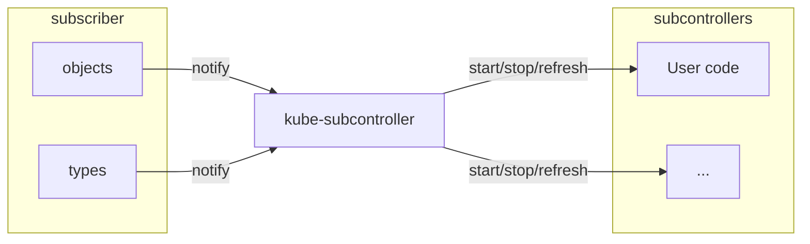

# kube-subcontroller

Used to build general-purpose Kubernetes controllers
that run independently on separate objects/resource types.

```mermaid
graph LR

subgraph subscriber
objects
types
end

subgraph subcontrollers
subctrl1[User code]
subctrl2[...]
end

objects & types -->|notify| kube-subcontroller
-->|start/stop/refresh| subctrl1 & subctrl2
```
